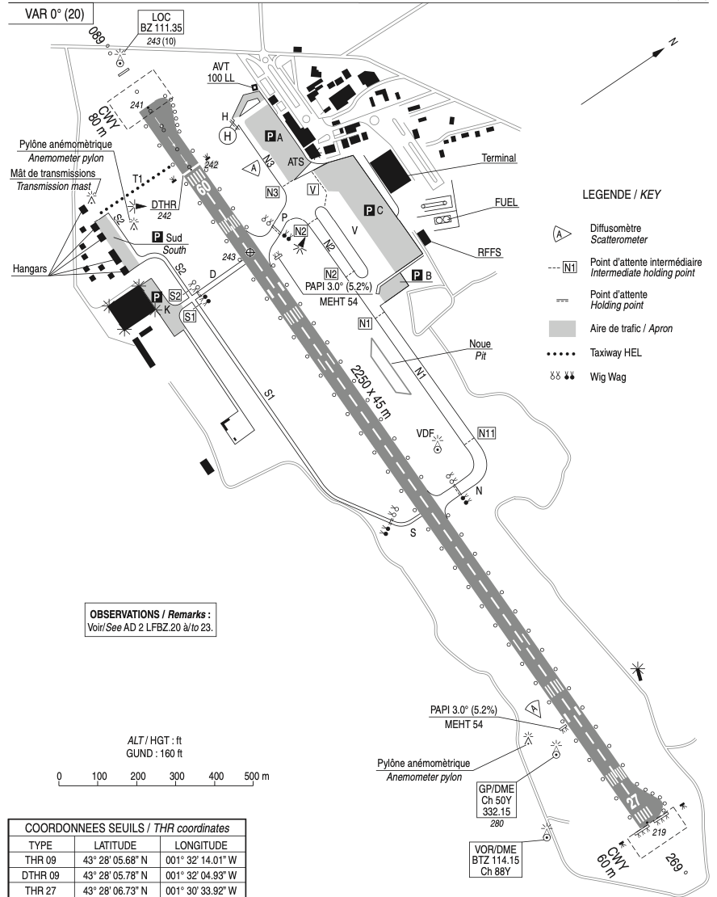
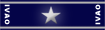
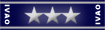
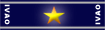

import { Callout } from "nextra/components";
import { Cards, Card } from "nextra/components";
import { GiWhiteBook, GiNotebook, GiGlobe } from "react-icons/gi";

## L'aéroport de Biarritz Pays Basque (`LFBZ`)

<Cards>
  <Card
    icon={<GiWhiteBook />}
    title="MANEX"
    href="https://storage.ivao.fr/lfbb_public/MANEX/MANEX_LFBZ.pdf"
  />
  <Card
    icon={<GiGlobe />}
    title="Schéma SIV"
    href="https://storage.ivao.fr/lfbb_public/Outils_Visuels/LFBZ_SIV_Schema.png"
  />
  <Card
    icon={<GiNotebook />}
    title="Fiche"
    href="https://storage.ivao.fr/lfbb_public/Fiche_AD/Fiche_LFBZ.pdf"
  />
</Cards>

L'aéroport de Biarritz Pays Basque est un aéroport international situé à Biarritz, dans le département des Pyrénées-Atlantiques, en région Nouvelle-Aquitaine.
Il est situé à 5 km au sud-est de Biarritz, à 3 km au sud-ouest de Bayonne et à 2 km au nord de la frontière espagnole.

L'aéropot est ouvert au trafic national et international commercial, régulier ou non, aux avions privés, aux IFR et VFR.

<Callout type="info">
  Biarritz est un petit aéroport avec un trafic assez faible, permettant pour
  une première expérience de découvrir les procédures de contrôle aérien.
</Callout>

### Description de l'aérodrome

#### Les positions de contrôle

Les positions de contrôle sont les suivantes :

| Position          | Callsign      | Fréquence | Horaires (UTC) | FRA                       |
| ----------------- | ------------- | --------- | -------------- | ------------------------- |
| Biarritz Sol      | `BIARITZ_GND` | 121.950   | 00:00 - 24:00  |  |
| Biarritz Tour     | `BIARITZ_TWR` | 118.700   | 00:00 - 24:00  |  |
| Biarritz Approche | `BIARITZ_APP` | 125.600   | 00:00 - 24:00  |  |
| Biarritz Contrôle | `BIARITZ_CTR` | 125.105   | 00:00 - 24:00  |  |

<Callout type="info">
  Si un ATC ouvre une position supérieure au sol, il doit contrôler toutes les
  positions inférieures non ouvertes dans la mesure de ses compétences et de la
  densité du trafic.
</Callout>

#### La piste

Il est équipé d'une piste en béton bitumineux de 2 250 mètres de long et 45 mètres de large, orientée 09/27 dont les caractéristiques sont les suivantes :

| RWY | TORA | TODA | ASDA | LDA  | Nature  |
| --- | ---- | ---- | ---- | ---- | ------- |
| 09  | 2250 | 2310 | 2250 | 2245 | Revêtue |
| 27  | 2230 | 2310 | 2230 | 2230 | Revêtue |

Les distances de décollage disponibles au croisement des voies de roulage sont les suivantes :

<table>
  <thead>
    <tr>
      <th>RWY</th>
      <th>Points d'attente</th>
      <th>Distance</th>
    </tr>
  </thead>
  <tbody>
    <tr>
      <td rowSpan={2}>09</td>
      <td>N1</td>
      <td>1060 m</td>
    </tr>
    <tr>
      <td>P</td>
      <td>1870 m</td>
    </tr>
    <tr>
      <td>27</td>
      <td>N1</td>
      <td>1320 m</td>
    </tr>
  </tbody>
</table>

#### Les aires de trafic

Les aires de stationnement sont composées de 3 parkings principaux :

- Le parking `Alpha`, situé au nord-ouest de la piste, est réservé à l'aviation générale.
- Le parking `Bravo`, situé au nord-est de la piste, est réservé à l'aviation générale.
- Le parking `Charlie`, situé au nord de la piste, est réservé à l'aviation commerciale.

<Callout type="warning">
  Il n'y a pas de terminal cargo donc par conséquent pas de zone de parking
  cargo.
</Callout>

#### Les voies de roulage

L'utilisation du taxiway **S1** est interdite la nuit et le jour si la RVR est inférieur à 800m. Après
l'atterrissage sauf indication contraire il est préférable de dégager la piste par le deuxième
taxiway (P).

### Les procédures de départ

Les itinéraires normalisés de départ (SID, Standard Instrument Departure) sont :

<table>
  <thead>
    <tr>
      <th>Piste</th>
      <th>SID</th>
      <th>Type</th>
      <th>Niveau initial</th>
    </tr>
  </thead>
  <tbody>
    <tr>
      <td rowSpan={9}>09</td>
      <td>**DONOS 2D**</td>
      <td>**RNAV**</td>
      <td>**FL080**</td>
    </tr>
    <tr>
      <td>DONOS 2E</td>
      <td>CONV</td>
      <td>FL080</td>
    </tr>
    <tr>
      <td>**SOSTO 2D**</td>
      <td>**RNAV**</td>
      <td>**FL070**</td>
    </tr>
    <tr>
      <td>**SOVOS 2D**</td>
      <td>**RNAV**</td>
      <td>**FL070**</td>
    </tr>
    <tr>
      <td>SOVOS 2E</td>
      <td>CONV</td>
      <td>FL070</td>
    </tr>
    <tr>
      <td>**SSN 2D**</td>
      <td>**RNAV**</td>
      <td>**FL080**</td>
    </tr>
    <tr>
      <td>SSN 2E</td>
      <td>CONV</td>
      <td>FL080</td>
    </tr>
    <tr>
      <td>**VAVIX 2D**</td>
      <td>**RNAV**</td>
      <td>**FL070**</td>
    </tr>
    <tr>
      <td>VAVIX 2E</td>
      <td>CONV</td>
      <td>FL070</td>
    </tr>
    <tr>
      <td rowSpan={8}>27</td>
      <td>**DONOS 2F**</td>
      <td>**RNAV**</td>
      <td>**FL080**</td>
    </tr>
    <tr>
      <td>DONOS 2W</td>
      <td>CONV</td>
      <td>FL080</td>
    </tr>
    <tr>
      <td>**SOVOS 2F**</td>
      <td>**RNAV**</td>
      <td>**FL070**</td>
    </tr>
    <tr>
      <td>SOVOS 2W</td>
      <td>CONV</td>
      <td>FL070</td>
    </tr>
    <tr>
      <td>**SSN 2F**</td>
      <td>**RNAV**</td>
      <td>**FL080**</td>
    </tr>
    <tr>
      <td>SSN 2W</td>
      <td>CONV</td>
      <td>FL080</td>
    </tr>
    <tr>
      <td>**VAVIX 2F**</td>
      <td>**RNAV**</td>
      <td>**FL070**</td>
    </tr>
    <tr>
      <td>VAVIX 2W</td>
      <td>CONV</td>
      <td>FL070</td>
    </tr>
  </tbody>
</table>

<Callout type="info">
  Pour le controleur `DEL`, il est important de vérifier que le pilote a bien
  reçu la SID correspondant à la piste en service et qu'elle est validée dans le
  plan de vol.
</Callout>

Pour les départs omnidirectionnels, les procédures de départ sont les suivantes :

- Piste 09 : Monter dans l'axe jusqu'à 1,9 Nm BTZ
- Piste 27 : Monter dans l'axe jusqu'à 2,6 Nm BTZ

<Callout type="info">
  Sur IVAO, il est assez rare qu'un pilote demande un départ omnidirectionnel.
  Cependant, lorsque ceci arrive, il faut savoir répondre positivement et
  correctement.
</Callout>

<Callout type="warning">
  Lorsque la clairance de départ est donnée par le `GND` ou la `TWR` et l'`APP`
  est présent, il faut coordonner avec lui la procédure à communiquer au pilote
  lors de la clairance de départ.
</Callout>
