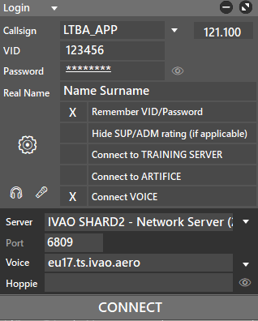

import { Callout } from "nextra/components";
import Image from "next/image";

## Comment vous connecter sur IVAO ?

Pour vous connecter sur IVAO, vous devez avoir téléchargé Aurora et avoir vos identifiants IVAO.

<Callout type="info">
  Si vous vous connectez pour la première fois, je vous conseille **très
  fortement** de vous connecter en mode **observateur** pour vous familiariser
  avec l'interface et comprendre comment ça fonctionne.
</Callout>

Une fois Aurora ouvert, vous trouverez une fenêtre de connexion en haut à droite. Cliquez dessus pour ouvrir la fenêtre de connexion, qui devrait ressembler à ceci :

Dans le Callsign, entrez le call sign de la position que vous souhaitez occuper (avec le format suivant: `CODE-OACI_POSTION`). Par exemple, si vous souhaitez contrôler la tour de Toulouse, entrez `LFBO_TWR`.

<Callout type="info">
  Si vous voulez vous connecter en mode observateur, entrez vos initials et
  `_OBS` à place de la position dans le Callsign. Par exemple, si votre nom est
  Jean Dupont et que vous souhaitez observer à Toulouse, entrez `LFBO_JD_OBS`.
</Callout>

<Callout type="info">
  Si vous ne connaissez pas le code OACI de l'aéroport, vous pouvez le trouver
  sur [cette page](https://fr.wikipedia.org/wiki/Code_OACI_des_aéroports).
</Callout>

Ensuite, entrez votre VID (Numéro de compte IVAO) et votre mot de passe dans les cases correspondantes. Cliquez sur "Connect" pour vous connecter.

<Callout type="warning">
  Si vous vous connectez à une position (hors observateur), vous devez maîtriser
  les fondamentaux et les procédures de la position que vous occupez. Si vous ne
  les maîtrisez pas, je vous conseille de vous connecter en mode observateur.
</Callout>
